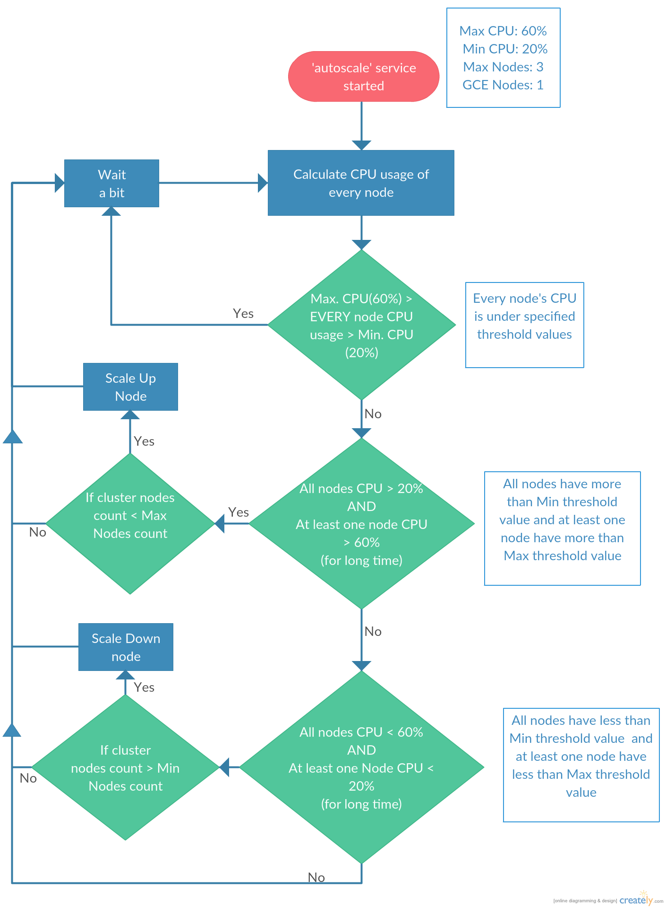
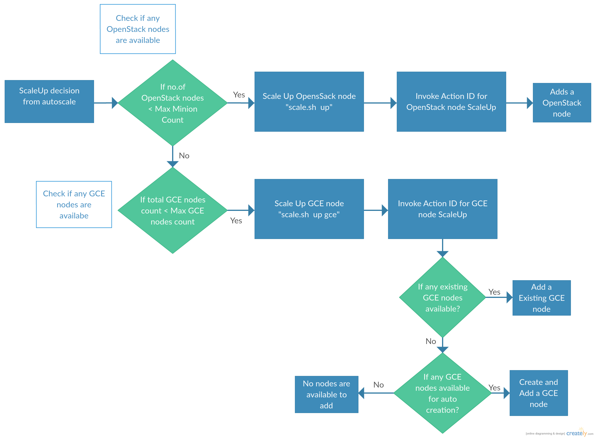
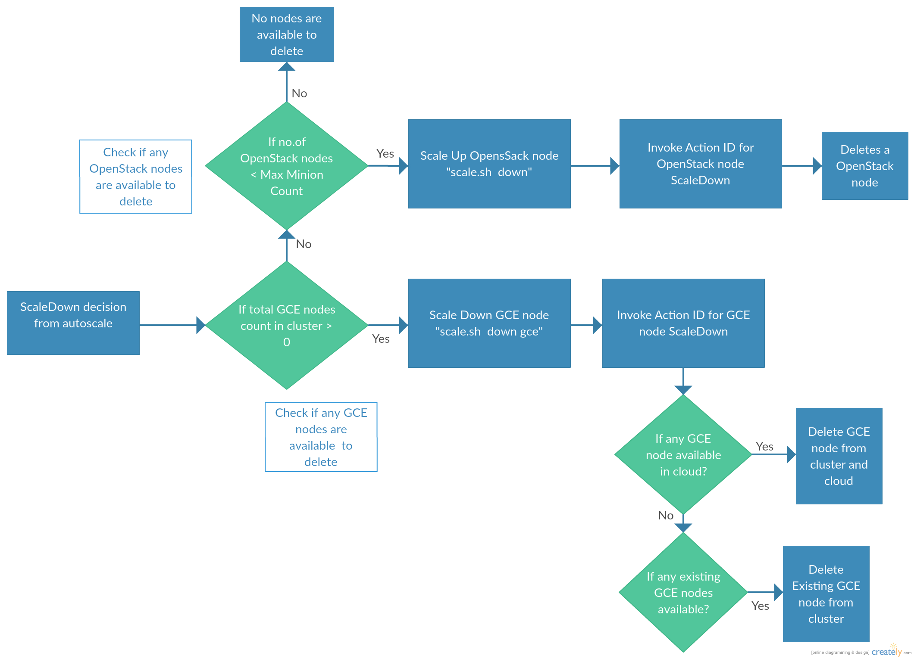

=================================================================================
OpenStack Murano Kubernetes - Auto Scaling Compute Infrastructure in Hybrid Cloud
=================================================================================

This document walks the reader on how to use the optional ability
in a OpenStack based Murano Kubernetes deployment, to auto scale nodes in Kubernetes 
cluster, based on CPU usage policy across nodes in Hybrid Cloud environment.

Users can define optimal cluster wide CPU usage (high/low) watermarks in the UI
presented during deployment of the Kubernetes Application from Murano catalog. 
Crossing these watermarks trigger Auto Scale process.

If Hybrid Auto scaling support is enabled, a service running on the Kubernetes
master node, can spin up or down nodes to either it.s own private OpenStack
or a connected public cloud service (such as Google Cloud)  and provision the new nodes
to become part of the Kubernetes cluster. Thus, extending the reach of private OpenStack
Kubernetes cluster elastically to a public cloud service.

Overview of Auto Scaling Nodes
------------------------------

Once the Kubernetes cluster is deployed and is up & running, every k8s node is monitored
by a built-in cAdvisor service. cAdvisor auto-discovers all containers in the machine and 
collects CPU, memory, filesystem, and network usage statistics.

A custom service named "autoscale" runs on the master node. This service helps to:
collect the CPU usage of every k8s node using cAdvisor and analyse it periodically. 
The "autoscale" service scales up a node when cluster nodes CPU usage exceeds the user defined 
upper threshold watermark. Similarly, a node is scaled down when cluster nodes CPU usage is less
than the defined lower threshold.

How to install autoscaling on Kubernetes
----------------------------------------
Assumption:
  User enables Auto Scaling option.

Fill the required fields like:

*  Max CPU usage number to scale
*  Min CPU usage number to scale down
*  HAProxy IP
*  Tenant name
*  Username and password for OpenStack Nodes (private) scaling.

The package deployment, installs the following :

* jq, sshpass and python3-numpy
* autoscale service
* metrics
* scale.sh files.

User defined inputs which are mention above are stored in a configuration file for auto scaling purpose.

Autoscaling Algorithm
---------------------
Needs the user to define the following params on the UI:
  * Max CPU% threshold for scale up
  * Min CPU% threshold for scale down
  * Max k8s Count: Maximum Openstack k8s nodes to scale
  * Total GCE nodes count: GCE node count that can be scaled up to.

#. The "autoscale" service sends request to the kubernetes master to poll and get state of k8s nodes.

#. For all nodes in .ready. state, the "autoscale"service requests cAdvisor of that node to get machine and resource usage details. Using these details, the "autoscale"service calculates the CPU usage of that node. This step is repeated for every k8s node.

#. The "autoscale" service stores all nodes CPU usage in a dictionary object for calculating state of cluster.

#. If CPU metrics from all nodes is within upper and lower CPU threshold criteria  set by user, step-1 is repeated after (a configurable) sleep period (15s for now).

#. The "autoscale" service requests for a scale up if:

    If one or more node is operating above an upper threshold CPU mark.
    And, remaining nodes are operating well above lower threshold CPU mark
#. The "autoscale" service requests for a scale down if:

    If one or more node is operating less than lower threshold CPU mark.
    And, remaining nodes operating within upper threshold CPU mark

#. If some nodes are found to be under lower threshold and some nodes operate above upper CPU threshold usage, the "autoscale" service expects Kubernetes service to distribute & balance load and repeats step-1.

Scaling
-------
Scaling needs the following parameters:
    Max k8s Count: Maximum Openstack k8s nodes to scale
    Total GCE nodes count: GCE node count that can be scaled up to.

**When ScaleUp is activated:**

* Get the current number of nodes in Cluster. Check the number of OpenStack and GCE nodes in the cluster.
* Check if any OpenStack nodes are available for scaling up. If yes, request .scale.sh. file for OpenStack node scaling.
* If the OpenStack nodes are already max.d, then check if any of the GCE nodes are available to add. If yes, then request for GCE scale up. Add a .type=GCE. label for identification.

**When ScaleDown is activated:**

* Check first if public GCE nodes can be scaled down. If yes, then scale down that node.
* If there are no GCE nodes in the Cluster, check if any of the OpenStack nodes are available to scale down. If yes, then scale down a OpenStack node until the count reaches  minimum operating K8s node count in the cluster.

========================
Hybrid Cloud Integration
========================
Hybrid cloud (GCE) integration is an optional ability to scale the nodes to/from Public cloud.

Overview of Kubernetes Hybrid Cloud (GCE)
-----------------------------------------

Kubernetes needs all nodes in the same network to form a cluster. In case of Hybrid Cloud, public nodes cannot communicate with OpenStack instances. This can be solved by installing OpenVPN rbridge network and provisioning the GCE nodes to be part of the bridge network

How to install Hybrid cloud in Murano
-------------------------------------

User can configure hybrid cloud section in the following two ways:

* Configuring the already available OpenVPN provisioned GCE nodes.
* GCE elastic scaling by creating/deleting instance on demand and then provisioning them using OpenVPN.

At the time of package deployment, GCE Common files setup will run, install necessary packages
and copy the files to GCE node and provision it.

Kubernetes Hybrid Cloud actions
--------------------------------
KubernetesCluster provides the following actions:

* `addGceNode`: Adds a GCE node to cluster. It can also create a GCE node and add it, if user configure options
* `deleteGceNode`: Delete the GCE node from cluster. It will delete the GCE instance from cloud if it it is created by action addGceNode

The HybridCloudAutoScale application class supports
---------------------------------------------------

HybridCloudAutoScale: Provides Kubernetes cluster with Auto Scaling and Hybrid Cloud (GCE) Integration functional support

`setupAutoscale()`
    This method installs the Auto Scale service on Master node.
`setupGCEScale()`
    This method installs the necessary files for adding a GCE node to the cluster. Also, installs the google-api-python-client library to create/delete GCE instances.
`addNode2Cluster()`
    It takes NodeIP, Username and Password as inputs and adds that node to the cluster.
`deleteNodeFromCluster()`
    It takes nodeIP and username as arguments and removes that node from the cluster
`addExistingNode()`
    This method adds an existing GCE node if user configure the existing nodes section.
`deleteExistingNode()`
    It removes the existing GCE node from the cluster.
`addGceNode()`
    It first creates a GCE instance. Then it installs the packages like docker and bridge utils. With help of OpenVPN server, it creates a secure connection between OpenVPN network and GCE instance. Whenever GCE instance gets VPN connection, it gets tap0 interface. We use this tap interface for adding GCE node to the cluster.
`deleteGceNode()`
    It deletes the GCE node from the cluster. Then it deletes the GCE instance from the cloud.
`deleteGoogleInstance()`
    It takes instance name as argument and deletes the instance from the cloud.
